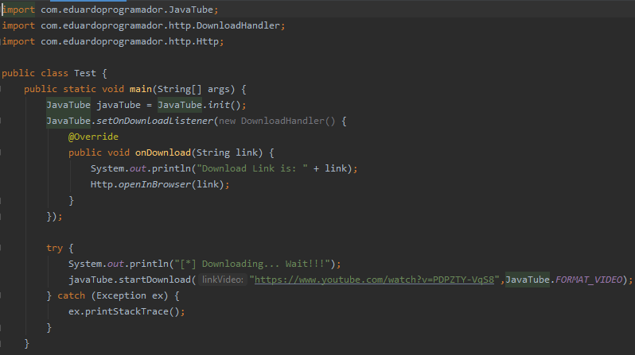

# JavaTube

## A full and easy Java library for download videos (.mp4) and music (.mp3) from Youtube links.

## Tutorial:

### 1) Import the JavaTube.jar file onto your Java Project

### 2) Read the class documentation

### 3) Example of Usage:

Copyright 2022. Eduardo Programador